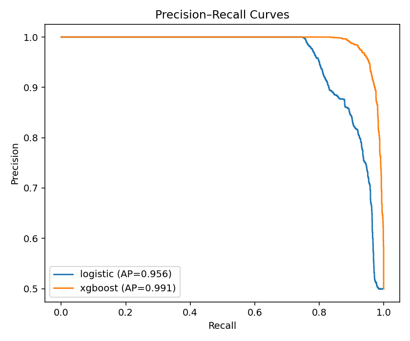

> 🛠️ **Note:** My *Exoplanet Candidate Validation* project is currently under construction — the machine learning pipeline is complete, and notebook visualizations are being added soon.

# 🪐 Exoplanet Candidate Validation ✨


This project builds a reproducible pipeline to classify exoplanet candidates as likely confirmed or unlikely based on orbital and stellar parameters. It combines transparent modeling with validation and interpretability, producing structured reports and notebook-based visualizations.

<p align="center">
  <a href="https://github.com/rhicarmel/exoplanet-validation/blob/main/notebooks/model.ipynb">
    
  </a>
</p>

<details>
  <summary><b>📑 Table of Contents</b></summary>

- [Overview](#overview)
- [Functionality](#functionality)
- [Results](#results)
- [Example Outputs](#example-outputs)
- [Tech Stack](#tech-stack)
- [Installation](#installation)
- [How to Run](#how-to-run)
- [Data](#data)
- [Methods](#methods)
- [Reproducibility](#reproducibility)
- [Notebooks](#notebooks)
- [Future Improvements](#future-improvements)
- [Author](#author)

</details>

## Functionality

- Fetch and version NASA Exoplanet Archive tables and optional Gaia cross-matches.
- Clean and join datasets, engineer features, and persist schemas.
- Train baseline (logistic regression) and tree-based models.
- Evaluate with ROC-AUC, precision, recall, F1, and calibration.
- Explain results with permutation importance, SHAP, and partial dependence.
- Export figures and metrics to `artifacts/plots` and `artifacts/metrics.json`.
- Review the full workflow through structured Jupyter notebooks.

## Key Insights

- The model uses physical and observational features to separate likely confirmations from low-likelihood candidates.
- Emphasis is on rigor and reproducibility. All inputs are hashed, and environments are pinned.
- Interpretability is central. The repo favors readable models and calibrated probabilities.

## Results

| Model               | ROC-AUC (CV) | Precision | Recall |  F1  | ROC-AUC (Holdout) |
| :------------------ | :----------: | :-------: | :----: | :--: | :---------------: |
| Logistic Regression |     0.94     |    1.00   |  0.75  | 0.86 |        0.94       |
| XGBoost             |     0.99     |    0.97   |  0.94  | 0.95 |        0.99       |

Results demonstrate well-calibrated probabilities and clear feature importance for physical parameters.

## Example Outputs

Below are key plots generated by the pipeline:

<p align="center">
  
  <br>
  
  
</p>

## Tech Stack

<p align="center">
  <a href="https://www.python.org/"></a>
  <a href="https://pandas.pydata.org/"></a>
  <a href="https://numpy.org/"></a>
  <a href="https://scikit-learn.org/"></a>
  <a href="https://xgboost.ai/"></a>
  <a href="https://shap.readthedocs.io/"></a>
  <a href="https://matplotlib.org/"></a>
  <a href="https://plotly.com/"></a>
  <a href="https://astroquery.readthedocs.io/"></a>
  <a href="https://jupyter.org/"></a>
</p>

## Installation

```bash
git clone <your-repo-url>.git
cd exoplanet-validation
make setup
```

## How to Run

```bash
Copy code
# 1) Fetch data from NASA Exoplanet Archive and write hashes
make fetch

# 2) Train models and save artifacts
make train

# 3) Evaluate and generate figures
make evaluate

# 4) Launch app notebook locally
make app

# 5) Build a short report for sharing
make report
```

## Data

- Primary: NASA Exoplanet Archive tables such as `pscomppars` and mission catalogs.
- Optional: Gaia DR3 cross-matches for stellar properties.
- Data are stored in `data/raw` and `data/processed`. Hashes are tracked in `artifacts/data_hash.json`.

## Methods

- Feature engineering: orbital period, estimated transit depth proxies, equilibrium temperature category, host star temperature and radius, system multiplicity, discovery method indicators.
- Models: logistic regression baseline and a tree-based model (Random Forest or XGBoost).
- Validation: stratified CV, holdout set, calibration curve, permutation importance, partial dependence, SHAP review.

## Reproducibility

- `requirements.txt` pins key versions.
- `Makefile` standardizes all commands.
- `artifacts/data_hash.json` records input hashes.
- `src/` provides modular, testable components.
- Random seeds are fixed for repeatability.

## Jupyter Notebooks

Use `notebooks/app.ipynb` as the main app. Expose inputs for file upload, run scoring, show top features and calibration, and allow report export.

## Notebooks

- `notebooks/eda.ipynb` – exploratory data analysis and feature review
- `notebooks/model.ipynb` – model training, validation, and interpretability
- `notebooks/app.ipynb` – optional interface for scoring new candidate files

## Future Improvements

- Add TESS and Kepler candidate tables for robustness tests.
- Add Bayesian calibration for probability tuning.
- Expand interpretability to include counterfactual explanations.

---

## Author

<p align="center">
  <b>Rhiannon Fillingham</b><br>
  <a href="https://www.linkedin.com/in/rhiannonfilli">
    
  </a>
  <a href="https://github.com/rhicarmel">
    
  </a>
</p>
